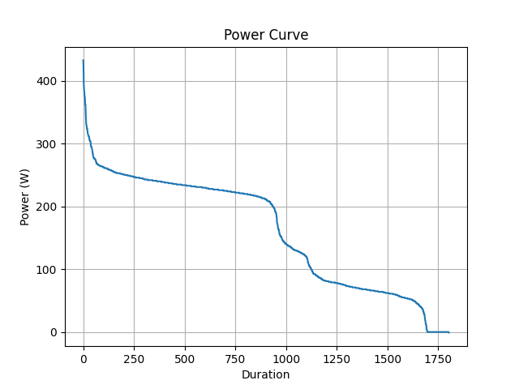

# programmieren_2_aufgabe_1
Dieses Repository beinhaltet den Code für Aufgabe 1:

# Projektname

## Repository herunterladen
Zuerst das Repository klonen:
bash
git clone https://github.com/Matthias-Zoller/programmieren_2_aufgabe_1.git
Dann in den Projektordner wechseln:

bash
cd DEIN-REPO
---

## Voraussetzungen
Benötigt:

- Python 3.10+
- PDM
- Git

### PDM installieren
bash
curl -sSL https://pdm-project.org/install-pdm.py | python3 -

---

## Projekt starten
bash
pdm run python main.py

---

## Virtuelle Umgebung aktivieren (optional)
bash
pdm venv activate

---

## Neue Pakete installieren
bash
pdm add paketname

Beispiel:
bash
pdm add pandas

